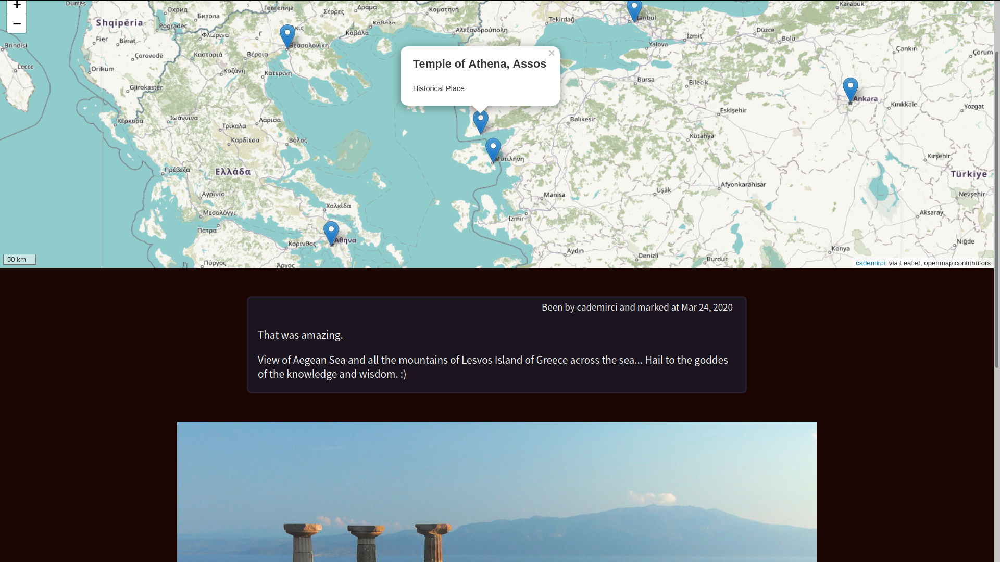

# been-and-mark
A map application with pins with photo and text.

## Usage

This is a simple django application with no package. Install django via `pip` (primarily `python` of course) and run the application by
following below:

Django can be installed by following the relevant instructions on &rarr; [Django installation](https://www.djangoproject.com/download/)

```
git clone https://github.com/cademirci/been-and-mark.git
cd been-and-mark/webapp_djangoleaflet
python manage.py runserver
```

## What Is been-and-mark?



been-and-mark application allows you to mark with a pin somewhere you have been on an open world map; put a photo and a text related with there and the memory. 

In this respect, it can be thought as some kind of simple Foursquare clone but been-and-mark is written for personal usage, like a blog or a diary let's say. I have written a web application
with and interactive map in my internship; then I wanted to put a simpler and joyful version of it into Github, as a self development. Plus this is a totally different idea actually.

